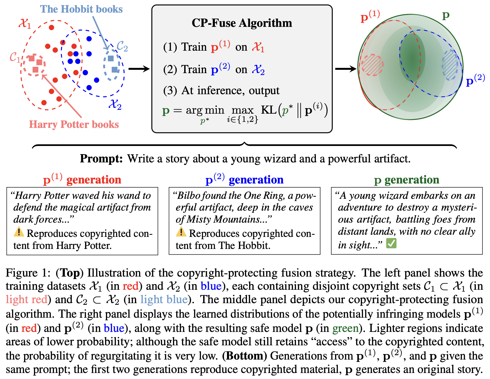

# CP-Fuse: Adaptive Model Fusion for Copyright-Protected Language Generation

<!-- [](https://arxiv.org/abs/2401.17823) -->
[](https://python.org/downloads/release/python-3123/)
[](LICENSE)
[](https://pytorch.org/)

* [Overview](#overview)
* [Contents](#contents)
* [Getting Started](#getting-started)
* [Usage](#usage)
* [Contributing](#contributing)
* [Contact](#contact)
* [Citation](#citation)

## Overview



This repository contains the Python implementation of Copyright-Protecting Model Fusion (CP-Fuse), a novel method for copyright protection introduced in the paper [*"Copyright-Protecting Language Generation via Adaptive Model Fusion"*](#). 

Traditional methods for mitigating copyright risks often involve post-processing constraints applied at inference time. However, these methods can be computationally intensive and may compromise the model's performance. CP-Fuse introduces a novel strategy that fuses the outputs of multiple models in a way that protects against copyright infringement. In particular, CP-Fuse adaptively aggregates the logits to minimize the reproduction of copyrighted content, adhering to a crucial balancing property to prevent the regurgitation of memorized data.

## Contents

The `cp_fuse` folder contains the core code of the package, organized into several subfolders.

- **cp_fuse/**: Core package containing the implementation of CP-Fuse.
- **examples/**: Example scripts to demonstrate the usage of training, evaluation, and data processing functions.

## Getting Started

### Dependencies

- **Python** 3.12.3
- **torch** 2.3.0
- **peft** 0.10.0
- **transformers** 4.40.0
- **datasets** 2.19.1
- **pynvml** 11.5.0
- **numpy** 1.26.4
- **pandas** 2.2.2
- **accelerate** 0.30.1
- **huggingface-hub** 0.23.4
- **bitsandbytes** 0.44.1

### Installation

To set up your environment and install the package, follow these steps:

#### Create and Activate a Conda Environment

Start by creating a Conda environment with Python 3.12.3. This step ensures your package runs in an environment with the correct Python version. 
```bash
conda create -n cp_fuse python=3.12.3
conda activate cp_fuse
```
#### Install the Package

There are two ways to install the package:

1. **Local Installation:**
   Start by cloning the repository from GitHub. Then, upgrade `pip` to its latest version and use the local setup files to install the package.
   ```bash
   git clone https://github.com/jaabmar/cp_fuse.git
   cd cp_fuse
   pip install --upgrade pip
   pip install -e .
   ```
2. **Direct Installation from GitHub:**
   You can also install the package directly from GitHub. 
   ```bash
   pip install git+https://github.com/jaabmar/cp_fuse.git
   ```
## Usage

### Training

The training script is accessible via the entry point `train`, which can be run directly from the terminal after the package is installed. This entry point corresponds to the `examples/train.py` script and includes flexible command-line arguments to specify model configuration, dataset splits, and training parameters.

**Example Command**:

```bash
train \
    --model_checkpoint meta-llama/Llama-2-7b-hf \
    --dataset_name StoryTelling \
    --epochs 20 \
    --seq_length 2048 \
    --n_train_samples 9000 \
    --num_splits 2 \
    --split 1 \
    --batch_size 1 \
    --learning_rate 5e-6 \
    --output_dir ./models
```

#### Training Arguments

- `--model_checkpoint` (str): Path to the model checkpoint. Default is `meta-llama/Llama-2-7b-hf`.
- `--dataset_name` (str): Name of the dataset to use for training.
- `--epochs` (int): Number of training epochs.
- `--seq_length` (int): Sequence length for model input.
- `--n_train_samples` (int): Number of training samples.
- `--num_splits` (int): Number of dataset splits for training. Default is 2.
- `--split` (int): Specify the training split (e.g., `1`).
- `--batch_size` (int): Batch size per training step.
- `--learning_rate` (float): Learning rate for training.
- `--quantize` (flag): Enable 8-bit quantization (LoRA) if provided.
- `--seed` (int): Random seed for reproducibility.
- `--gradient_accumulation_steps` (int): Number of steps to accumulate gradients.
- `--save_freq` (int): Frequency (in epochs) to save model checkpoints.
- `--eval_freq` (int): Frequency (in epochs) to evaluate the model.
- `--output_dir` (str): Directory to save model checkpoints.

### Evaluation

The evaluation script is accessible via the entry point `evaluate`. This entry point corresponds to the `examples/evaluate.py` script and evaluates trained models on specified datasets, using either a single model or combining two models with CP-Fuse.

**Example Command**:

```bash
evaluate \
    --model_checkpoint1 ./models/StoryTelling_split_1 \
    --model_checkpoint2 ./models/StoryTelling_split_2 \
    --dataset_name StoryTelling \
    --n_test_samples 500 \
    --batch_size 16 \
    --grid_size 10 \
    --output_dir ./eval
```

#### Evaluation Arguments

- `--model_checkpoint1` (str): Path to the first model checkpoint. Required.
- `--model_checkpoint2` (str): Path to the second model checkpoint (for CPModel).
- `--dataset_name` (str): Name of the dataset for evaluation.
- `--n_test_samples` (int): Number of test samples. Default is 500.
- `--batch_size` (int): Batch size for evaluation. Default is 32.
- `--grid_size` (int): Grid size for grid search when using CPModel. Default is 10.
- `--verbose` (flag): Enable verbose output during evaluation if provided.
- `--output_dir` (str): Directory to save evaluation results.

## Contributing

We welcome contributions to improve this project. Here's how you can contribute:

1. Fork the Project
2. Create your Feature Branch (`git checkout -b feature/AmazingFeature`)
3. Commit your Changes (`git commit -m 'Add some AmazingFeature'`)
4. Push to the Branch (`git push origin feature/AmazingFeature`)
5. Open a Pull Request


## Contact

For any inquiries, please reach out:

- Javier Abad Martinez - [javier.abadmartinez@ai.ethz.ch](mailto:javier.abadmartinez@ai.ethz.ch)
- Konstantin Donhauser - [konstantin.donhauser@ai.ethz.ch](mailto:konstantin.donhauser@ai.ethz.ch)

## Citation

If you find this code useful, please consider citing our paper:
 ```
@inproceedings{abadcopyright2024,
  title={Copyright-Protected Language Generation via Adaptive Model Fusion},
  author={Abad, Javier and Donhauser, Konstantin and  Pinto, Francesco and Yang, Fanny},
  year={2024},
}
```
